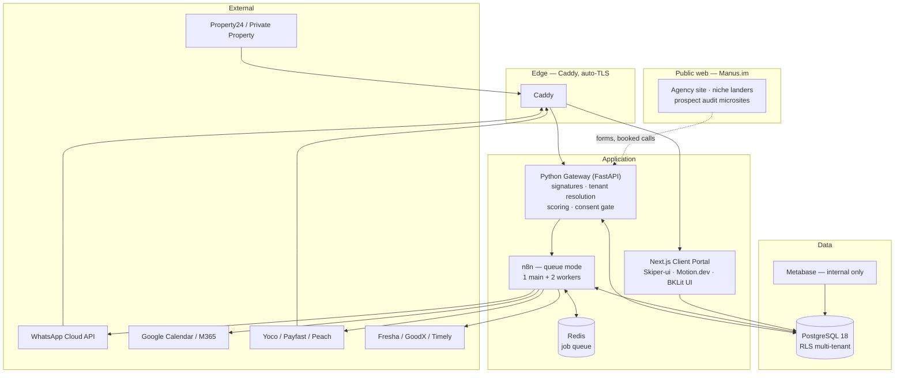

# Operational Playbook — SA Automation Agency

**Two niches. One stack. Rand-denominated ROI you can prove on a single deal.**

This is the master operating document for a South African automation agency
selling productised workflow systems to local SMEs at **R16 500 – R49 500 per
month** (the $1k–$3k band at ~R16.50/USD). It covers what to sell, to whom, how
to build it, how to keep it running, how to present it, and how to sell it.

It is written to be executed, not admired. Every number in it is either sourced
or explicitly labelled as an assumption you must replace with your own data
after the first three clients.

---

## Contents

| § | Section | What it answers |
|---|---------|-----------------|
| [1](#1-the-why--niche-selection) | The Why | Which two niches, and why these two in South Africa |
| [2](#2-the-offers) | The Offers | Exactly what you sell at each price point |
| [3](#3-the-setup--technical-build) | The Setup | Architecture, n8n, PostgreSQL 18, Python, integrations |
| [4](#4-the-upkeep--running-it) | The Upkeep | Runbooks, monitoring, backups, change control, testing, cost control |
| [5](#5-the-presentation-layer) | The Presentation | Manus.im, Skiper-ui, Motion.dev, BKLit UI, the portal |
| [6](#6-the-pitch) | The Pitch | Scripts, discovery, objections, proposals, pricing conversations |
| [7](#7-target-identification) | Targeting | How to spot a business that is missing these systems |
| [8](#8-onboarding--the-first-90-days) | Onboarding | The delivery sequence that produces a renewal |
| [9](#9-the-financial-model) | Financials | Unit economics, capacity, break-even |
| [10](#10-compliance--the-non-negotiables) | Compliance | POPIA, HPCSA, FICA, PPRA, WhatsApp policy |
| [11](#11-repository-layout--quickstart) | Repo | What is in this folder and how to run it |

---

## 1. The Why — Niche Selection

### 1.1 How the seven were scored

Each candidate niche was scored on six factors that actually determine whether
a R30 000/month retainer survives its third invoice in *this* market.

| Niche | Ticket value | ROI provability | Owner's pain | Regulatory drag | Incumbent tooling | Scalability | **Total** |
|---|---|---|---|---|---|---|---|
| **Real estate** | 5 | 5 | 5 | 3 | 4 | 5 | **27** |
| **Med spas** | 5 | 5 | 5 | 3 | 4 | 4 | **26** |
| Dentists | 3 | 4 | 3 | 2 | 1 | 4 | 17 |
| Law firms | 5 | 2 | 3 | 1 | 3 | 3 | 17 |
| HVAC | 3 | 3 | 3 | 5 | 4 | 3 | 21 |
| Gyms | 2 | 3 | 4 | 4 | 2 | 3 | 18 |
| Restaurants | 1 | 2 | 4 | 4 | 2 | 3 | 16 |

*5 = most favourable. "Incumbent tooling" scores high when the market does NOT
already ship the feature you would be selling.*

The two winners are **Real Estate** and **Med Spas**, and they are winners for
the same underlying reason: in both, a single recovered transaction pays for a
month of your retainer, and the client can verify that themselves without
taking your word for anything.

---

### 1.2 Niche A — Real Estate: sell them follow-up

#### The economics that make this work

South Africa's average house price sits at roughly **R1.75 million** with a
median nearer **R1.3 million**. Estate agent commission is negotiable but runs
**5–7.5% plus VAT**. On a R1.5m sale at 6%, that is **R90 000 gross commission**;
after a typical 50/50 agency–agent split the agency banks around **R45 000**.

> **One additional transfer per month covers a R33 000 retainer 1.4× over.**

That is the entire pitch, and it is arithmetic the principal does in their head
while you are still talking. No other niche on the list has an ROI story this
short.

The timing is right too. The FNB house price index averaged **5.7% growth in
Q1 2026**, up from roughly 4% across 2025, with real (post-inflation) price
growth now in its eleventh consecutive month — the first sustained real growth
since 2021. FNB's estate-agent activity rating is at **6.3/10**, comfortably
above its long-run average. Agencies have cash and are hiring. Cash and hiring
is when SMEs buy systems.

#### The structural pain

1. **Lead sources are fragmented and land in personal WhatsApp.** Property24,
   Private Property, the agency's own site, Facebook Marketplace, show days,
   walk-ins, referrals. Almost none of it is centralised. The lead lives on one
   agent's phone.
2. **Speed to first response is measured in hours or days.** SA portal leads
   routinely sit until the agent is out of a show day. The buyer has already
   enquired on four other listings.
3. **Agents are independent contractors, and they churn.** When an agent
   leaves, their pipeline leaves with them. This is a principal's single
   greatest operational fear, and it is the pitch that gets you in the room:
   *this system means the agency owns the relationship, not the agent.*
4. **Show days are a paper clipboard.** The Sunday show house is a uniquely
   entrenched SA ritual and the largest un-captured lead source in residential
   property. A pavement board with a QR code, a WhatsApp opt-in, and a 90-day
   nurture sequence is the single highest-yield automation in this niche — and
   it demos beautifully.
5. **Sole mandates lapse unnoticed.** Nobody is watching the expiry date. Every
   lapsed mandate without a renewal conversation is commission that walks.
6. **FICA is a permanent low-grade anxiety.** Estate agencies are accountable
   institutions and must perform customer due diligence. Chasing IDs, proof of
   address and bank confirmations is universally hated. Automating the chase is
   boring, unglamorous, and closes deals.

#### Who to target specifically

| Profile | Why they are ready | Where to find them |
|---|---|---|
| **Independent multi-branch agencies, 15–60 agents** | Too big for a spreadsheet, too small for enterprise software, no franchise CRM mandated from head office | Pretoria East, Fourways/Northriding, Durban North & Umhlanga, Somerset West, Gqeberha, Bloemfontein |
| **Franchisees of national brands** (RE/MAX, Seeff, Rawson, Chas Everitt, Engel & Völkers) | They get a national CRM they resent and buy their own local tooling anyway. **Sell to the principal, never head office.** | Every major metro; find the franchise directory, then the individual branch site |
| **Rental & letting portfolios / managing agents, 100–800 units** | Lease renewals, arrears follow-up, maintenance tickets, inspection scheduling. Recurring, unsexy, perfectly automatable, and the revenue is annuity so they think in monthly costs already | Sectional title management, student accommodation near UP/UCT/Wits/NWU |
| **Estate & off-plan development sales teams** | 6–24 month nurture cycles on off-plan units and *nobody* nurtures for 24 months manually | Waterfall City, Steyn City, Val de Vie, Whale Coast, Balwin developments |
| **Buyer's agents & relocation specialists** | Semigration (Gauteng → Western Cape) is inherently a long-nurture business | Cape Town, Garden Route, KZN North Coast |
| **Commercial & industrial brokerages** | Few, high-value, very long cycles, terrible follow-up discipline | Joburg South, Cape Town foreshore, Umhlanga Ridge |

**Sweet spot:** 20–40 agents, one or two branches, principal still personally
involved in deals, website built 2019–2022, Property24 listing count between
40 and 200.

---

### 1.3 Niche B — Med Spas: sell them full calendars

#### The economics that make this work

This is a yield-management problem wearing a healthcare costume, which is
exactly the shape of problem your financial-modelling background is built for.

- **It is cash-pay.** No medical aid claim friction, no scheme tariff codes, no
  Discovery/Momentum rejections. Money arrives at time of service. This alone
  separates med spas from dentists.
- **The market is compounding.** South Africa's aesthetic medicine market is
  projected to reach roughly **US$568 million by 2033 at an 11.1% CAGR**, with
  aesthetic devices growing at about **11.5% CAGR** to 2030. It is the fastest-
  growing consumer-health segment in the country.
- **Ticket sizes are real.** Botulinum toxin R2 500–R6 000 per area; dermal
  filler R4 500–R9 000 per syringe; skin-needling courses R6 000–R12 000; laser
  hair removal packages R8 000–R20 000; body contouring R15 000–R40 000. A
  retained patient is worth **R30 000–R80 000+ per year**.
- **Capacity is fixed and perishable.** Three treatment rooms × ten hours is
  thirty chair-hours a day, and an unsold 14:00 slot on Tuesday is gone
  forever. There is no inventory carry.

> **Eight recovered no-shows a month at R3 500 each is R28 000 — the retainer,
> from leakage recovery alone, before a single new patient.**

#### The structural pain

1. **The owner is the practitioner.** The doctor or aesthetic nurse is *in* the
   chair all day. Admin happens at 21:00, badly, or falls to one overloaded
   receptionist.
2. **Rebooking discipline is the entire business.** Toxin needs re-treatment at
   12–16 weeks. Filler at 9–18 months. Laser hair removal is a strict 6–8
   session protocol. Needling at 4–6 weeks. **Missing the interval degrades the
   clinical result.** This makes the recall message a treatment-quality
   intervention rather than marketing — which is both the ethical basis and the
   legal basis for sending it.
3. **No-shows and same-day cancels run 15–30% of slots.** Deposits, tiered
   confirmations and automatic waitlist backfill attack this directly and the
   result is visible on the bank statement within a fortnight.
4. **Consultations that never convert.** Nobody follows up a consult that
   didn't book on the day.
5. **Courses that stop at session 3 of 8.** Half the package revenue,
   unrealised, sitting in the patient file.

#### Who to target specifically

| Profile | Why they are ready | Where to find them |
|---|---|---|
| **Doctor-owned aesthetic clinics, 1–3 practitioners, 2–6 rooms** | Highest ticket, worst admin capacity, owner's time is literally the product | Sandton, Rosebank, Bryanston, Umhlanga, Ballito, Sea Point, Claremont, Stellenbosch, Menlyn |
| **Nurse-led injectable clinics & "skin bars"** | Fastest-growing sub-segment, near-zero systems, often operating inside a salon or gym | Suburban lifestyle centres nationally |
| **Device-heavy body-contouring studios** | They financed a R400k–R1.2m machine. There is a **lease payment** and genuine utilisation panic. This is the single best prospect profile in either niche | Search for CoolSculpting, EMSculpt, Morpheus8, HydraFacial, Ultherapy on SA sites |
| **Dermatology practices with a cash-pay aesthetic arm** | Split billing; the aesthetic side is always the under-systemised one | Established practices in the major metros |
| **Multi-site medi-spa groups, 3–8 branches** | Cross-branch utilisation and central booking is a problem they cannot solve with a receptionist | Mall of Africa, Gateway, Canal Walk, V&A Waterfront |
| **Hair restoration & medical weight-management (GLP-1) clinics** | Monthly injection cadence is a perfect recall protocol, and the segment is booming | Johannesburg and Cape Town, mostly since 2024 |

**Sweet spot:** two or more treatment rooms, at least one financed device, 4.3+
Google rating with 60+ reviews, no online booking on the website, and a most-
recent review older than four months.

---

### 1.4 Why the other five lose in South Africa

Know these cold — a prospect *will* ask why you don't do dentists.

- **Dentists.** Revenue is anchored to medical aid scheme tariffs, which caps
  what automation can add. Worse, the incumbent practice management systems
  (GoodX, Elixir, Healthbridge) already ship SMS recall. You would be selling a
  feature they already own, and HPCSA advertising rules constrain the rest.
- **Law firms.** Legal Practice Council advertising rules, trust-account
  sensitivity, and slow conservative buying. Conveyancing is the one genuinely
  good sub-niche — but the bottleneck is the Deeds Office, a state dependency
  you cannot automate. ROI attribution becomes an argument, and arguments lose
  renewals. Revisit as niche four.
- **Gyms.** Discovery Vitality and Momentum Multiply subsidise the majors and
  distort the independent market. A 120-member reformer studio bills perhaps
  R150 000/month; a R30 000 retainer is 20% of revenue and unsellable. Churn is
  also blamed on price, not on follow-up, so you would be fighting the owner's
  own diagnosis.
- **Restaurants.** The thinnest margins and highest failure rate in SA SME-land.
  Reputation management is perceived as a R1 500/month add-on to Dineplan. It
  cannot hold the price band.
- **HVAC.** The genuine SA analogue is solar/inverter installers, and that boom
  cooled through 2025–26 as load shedding eased. Real HVAC is commercial-
  contract-driven with procurement cycles, not lead follow-up. Viable as niche
  three; not as a first bet.

---

### 1.5 Pricing, in rands

Quote in **ZAR**. The USD band is your positioning reference, not your invoice.
At ~R16.50/USD (spot was R16.54 on 31 July 2026; the 2026 average is R16.42):

| Tier | USD ref | **Monthly (ZAR)** | Setup fee | Term |
|---|---|---|---|---|
| **Foundation** | ~$1 000 | **R16 500** | R25 000 | 6 months |
| **Growth** | ~$2 000 | **R33 000** | R40 000 | 6 months |
| **Performance** | ~$3 000 | **R49 500** | R60 000 | 12 months |

Three rules:

1. **The setup fee is non-negotiable and non-refundable.** It funds the build
   and it filters out tyre-kickers more effectively than any qualifying
   question.
2. **Include an annual escalation clause** — CPI + 3%, floor 8%. Every SA
   commercial lease has one; nobody blinks.
3. **Never price in dollars to a local SME.** It reads as offshore, invites a
   currency conversation you cannot win, and creates a rand-hedge problem for
   the client. Your *costs* are partly dollar-denominated (Meta, AI APIs), so
   carry that in your margin, not on their invoice.

---

## 2. The Offers

Productised. Three tiers per niche, same underlying platform, different
workflow counts and SLAs. **Do not build bespoke.** The margin in this business
comes entirely from the fact that client eleven costs you four days of work,
not four weeks.

### 2.1 Real Estate — "The Follow-Up Engine"

| | Foundation R16 500 | Growth R33 000 | Performance R49 500 |
|---|---|---|---|
| Portal lead capture (P24, Private Property, site) | ✅ | ✅ | ✅ |
| Sub-60-second WhatsApp first response | ✅ | ✅ | ✅ |
| Round-robin routing + escalation if unclaimed | ✅ | ✅ | ✅ |
| 90-day automated nurture sequences | 2 sequences | 6 sequences | Unlimited |
| Digital show-day register (QR → WhatsApp) | — | ✅ | ✅ |
| Viewing confirmations + reminders | ✅ | ✅ | ✅ |
| Post-viewing feedback → auto-report to seller | — | ✅ | ✅ |
| Sole-mandate expiry watchlist | — | ✅ | ✅ |
| FICA document collection & chase | — | ✅ | ✅ |
| Bond-origination handoff (ooba / BetterBond) | — | — | ✅ |
| Seller valuation-request funnel | — | — | ✅ |
| Client portal with live dashboards | Read-only | Full | Full + per-agent |
| Monthly performance review call | — | 30 min | 60 min, on site |
| Support SLA | Next business day | 4 business hours | 2 hours, 07:00–19:00 |

### 2.2 Med Spa — "The Full Calendar System"

| | Foundation R16 500 | Growth R33 000 | Performance R49 500 |
|---|---|---|---|
| WhatsApp booking assistant | ✅ | ✅ | ✅ |
| Tiered appointment confirmations (72h/24h/2h) | ✅ | ✅ | ✅ |
| Clinical recall engine (per treatment protocol) | 3 protocols | All protocols | All + course tracking |
| No-show recovery sequence | ✅ | ✅ | ✅ |
| Deposit collection links (Yoco/Payfast/Peach) | — | ✅ | ✅ |
| Waitlist auto-backfill on cancellation | — | ✅ | ✅ |
| Consult-to-treatment nurture | — | ✅ | ✅ |
| Course completion chase (session 3 of 8) | — | ✅ | ✅ |
| Private post-visit feedback capture | ✅ | ✅ | ✅ |
| Chair-utilisation & leakage dashboard | Read-only | Full | Full + per-practitioner |
| Reactivation campaigns (lapsed >6 months) | — | Quarterly | Monthly |
| Monthly performance review call | — | 30 min | 60 min, on site |
| Support SLA | Next business day | 4 business hours | 2 hours, 07:00–19:00 |

> **Note on reviews:** for HPCSA-registered practitioners, feedback capture is
> **private**. Nothing in this system auto-solicits a public review or
> republishes patient praise. See [§10](#10-compliance--the-non-negotiables).

---

## 3. The Setup — Technical Build

### 3.1 Architecture



**The one architectural decision that matters:** every client is a *tenant row*,
not a *deployment*. Isolation is enforced inside PostgreSQL with row-level
security keyed on a session variable. Running a separate n8n + Postgres stack
per client feels safer and will cap you at six clients. See
[`db/001_core.sql`](db/001_core.sql).

### 3.2 Hosting

Host **in South Africa**. Not because POPIA strictly requires it — s72 permits
cross-border transfer under conditions — but because it removes the entire
conversation from your sales calls, and latency to Meta's local edge and to
your clients is materially better.

| Option | When |
|---|---|
| **Hetzner (Pty) Ltd SA** — Samrand | Default. Local billing, local support, good price/performance |
| **Xneelo** | Alternative local, strong uptime record |
| **Africa Data Centres / Teraco co-lo** | Once you exceed ~40 tenants or a client demands a co-lo audit |
| **Hetzner Cloud (Germany)** | Only if you accept the s72 cross-border transfer paperwork. Cheaper; harder to sell |

**Starting spec:** 4 vCPU / 16 GB / 200 GB NVMe. That carries ~15 tenants at the
message volumes in [§9](#9-the-financial-model). Add a second host for
Postgres before you add a third for n8n — you will hit I/O before you hit CPU.

### 3.3 Bootstrap

```bash
git clone <this repo> && cd automation-agency/infra
cp .env.example .env

# Generate every secret. Do not reuse, do not shorten.
for k in PG_SUPERUSER_PASSWORD APP_DB_PASSWORD PORTAL_DB_PASSWORD \
         N8N_DB_PASSWORD METABASE_DB_PASSWORD REDIS_PASSWORD \
         N8N_ENCRYPTION_KEY GATEWAY_API_KEY PORTAL_AUTH_SECRET; do
  echo "$k=$(openssl rand -base64 36)"
done >> .env   # then edit .env and remove the duplicated blank keys

docker compose --env-file .env up -d
docker compose logs -f postgres   # watch db/*.sql apply in order
```

The migrations in [`db/`](db/) apply automatically on first boot, in numeric
order. `004_analytics.sql` ends with a guardrail that **refuses to apply** if any
table carrying `tenant_id` is missing row-level security. That check is the
difference between a rough week and a client-losing data leak.

> **Validation status.** All five migrations apply cleanly against PostgreSQL
> 18.4. Database invariants verified: cross-tenant RLS isolation under
> `agency_app`; empty tenant context returning zero rows; the consent gate
> failing closed, opening on consent, closing on withdrawal, and staying closed
> under suppression; room and practitioner double-booking rejection with
> correct rebooking after cancellation; the PG18 temporal primary key rejecting
> overlapping room closures; the portal role reading only its own tenant
> through the analytics views and being unable to write; and the RLS guardrail
> correctly failing a deliberately unprotected table.
>
> The gateway is covered by [`tools/smoke_check.py`](tools/smoke_check.py) —
> **28 assertions, all passing** against a live PG18 instance. See
> [§4.7](#47-testing).

> **Escrow `N8N_ENCRYPTION_KEY` somewhere off this machine, today.** Lose it and
> every stored credential for every client becomes unrecoverable ciphertext.

### 3.4 PostgreSQL 18 — the patterns worth using

Version 18 is a hard floor for this schema. Four features earn their keep:

**`uuidv7()` primary keys.** Time-ordered UUIDs give you random-key privacy with
sequential-key index locality. Once `core.event` is in the tens of millions of
rows, the difference between v4 and v7 is the difference between a portal that
loads and one that times out.

```sql
id uuid PRIMARY KEY DEFAULT uuidv7()
```

**Virtual generated columns.** Computed on read, zero write cost, cannot drift
from their inputs. Used for every derived business metric so the portal and the
workflows can never disagree about what a number means:

```sql
ALTER TABLE realestate.lead
  ADD COLUMN response_seconds integer
  GENERATED ALWAYS AS (
    CASE WHEN first_response_at IS NOT NULL
         THEN GREATEST(0, EXTRACT(EPOCH FROM (first_response_at - received_at))::int)
    END
  ) VIRTUAL;
```

*Three constraints to remember*, all of which this schema hit in testing on
18.4:

1. The expression must be immutable — no `now()`, no sub-selects.
2. **Virtual generated columns cannot call user-defined functions.** Where you
   need one, the column must be `STORED`. See `outstanding_count` in
   [`db/002_realestate.sql`](db/002_realestate.sql).
3. **Virtual generated columns cannot reference user-defined types**, which
   includes enums. `medspa.appointment.is_leakage` is `STORED` for exactly this
   reason — and stored turns out to be better there anyway, since a stored
   column can be indexed and every leakage query filters on it.

**Temporal constraints.** PostgreSQL 18 added `WITHOUT OVERLAPS`, which makes
"no two closures on the same room at the same time" a database guarantee:

```sql
PRIMARY KEY (tenant_id, room_id, during WITHOUT OVERLAPS)
```

For appointments, use a GiST `EXCLUDE` constraint instead — temporal unique
constraints do not accept a partial `WHERE`, and a *cancelled* 14:00 must not
block a rebooked 14:00:

```sql
CONSTRAINT appointment_room_no_overlap
  EXCLUDE USING gist (tenant_id WITH =, room_id WITH =, during WITH &&)
  WHERE (status NOT IN ('cancelled_late','cancelled_early','no_show'))
```

Double-booking a clinic's laser room is the fastest way to lose the account.
Enforce it in the database, not in a workflow.

**Asynchronous I/O.** Set `io_method = worker` (portable) or `io_uring` on a
kernel ≥ 5.19. On NVMe with the analytics views this is a real, measurable win.

**`RETURNING` with `OLD` and `NEW`** — new in 18, and genuinely useful for
writing an audit trail from a single statement inside an n8n Postgres node:

```sql
UPDATE realestate.lead SET stage = 'qualified' WHERE id = $1
RETURNING WITH (OLD AS o, NEW AS n) o.stage AS was, n.stage AS now;
```

**One hard-won detail in the consent ledger.** `core.consent.captured_at`
defaults to `clock_timestamp()`, **not** `now()`. `now()` returns the
transaction start time, so a grant and a withdrawal written in the same
transaction carry an identical timestamp and `DISTINCT ON` resolves the tie
arbitrarily — meaning a withdrawal can silently lose to the grant it was meant
to revoke. The view also tie-breaks on `id DESC`, which works because uuidv7 is
time-ordered. This was a live bug caught in testing, and it is the kind that
surfaces as a regulatory complaint rather than an error log.

**Tenant context.** Every connection sets the GUC transaction-locally, so a
pooled connection can never carry one client's context into the next execution:

```sql
SELECT set_config('app.tenant_id', $1, true);
```

In n8n this is the **first node of every workflow**. Make it a sub-workflow so
it cannot be forgotten.

### 3.5 n8n — the patterns that survive twenty clients

1. **Queue mode from day one.** One main process, two workers, Redis in
   between. Retro-fitting it under load is miserable.
2. **One workflow per capability, not per client.** Client-specific behaviour
   comes from `agency.tenant` and `agency.integration` rows read at runtime.
   Twenty clients should mean ~25 workflows, not 500.
3. **A single `router` webhook.** The Python gateway resolves the tenant and
   posts a normalised `{tenant_id, event, payload}` envelope to one entry point.
   A Switch node fans out to sub-workflows. One public webhook to secure, one
   place to add logging.
4. **Never send marketing without calling the consent gate.** Every outbound
   marketing branch starts with an HTTP node to `POST /consent/check` and
   short-circuits on `false`. See [`tools/gateway.py`](tools/gateway.py).
5. **Version control the workflows.** Export nightly to [`workflows/`](workflows/)
   via the n8n API and commit. The n8n UI is not a source of truth.
6. **Error workflow on every production workflow.** Route failures to a
   dedicated workflow that writes `core.event` and posts to your ops channel.
   A client noticing an outage before you do is the fastest route to churn.
7. **Prune execution data aggressively.** 14 days, successes not saved. This is
   both a performance measure and a POPIA s14 retention measure.
8. **Idempotency keys on everything that sends.** Meta retries webhooks. Without
   a unique constraint on `(provider, provider_msg_id)` you *will* double-message
   a client's patient list, and you will only find out from them.

### 3.6 Workflow catalogue

#### Real estate

| # | Workflow | Trigger | What it does |
|---|---|---|---|
| RE-01 | `lead.ingest` | Gateway webhook / IMAP / portal | Normalise, dedupe on E.164, insert lead, emit `lead.captured` |
| RE-02 | `lead.instant_response` | `lead.captured` | WhatsApp template inside 60s, log `first_response_at` |
| RE-03 | `lead.route` | `lead.captured` | Score via `POST /score/lead`, round-robin by suburb + band, escalate to principal if unclaimed in 15 min |
| RE-04 | `lead.nurture` | Scheduled, `next_touch_due_at` | Day 1/3/7/14/30/60/90 cadence, stops on any reply |
| RE-05 | `showday.register` | QR scan → gateway | Digital register, POPIA consent capture, instant "thanks for visiting" |
| RE-06 | `showday.followup` | 2h after show day ends | Feedback ask, similar-listing suggestions, seller-intent branch |
| RE-07 | `viewing.confirm` | Viewing created | Confirmation, 24h reminder, 2h reminder, no-show branch |
| RE-08 | `viewing.feedback` | 3h after viewing | Buyer feedback → auto-formatted seller report. **The seller-retention weapon** |
| RE-09 | `mandate.watch` | Daily 06:00 | Sole mandates expiring in 45/21/7 days → principal + agent task |
| RE-10 | `fica.chase` | FICA request created | Secure upload link, reminders at 2/5/9 days, escalate at 14 |
| RE-11 | `report.weekly` | Monday 06:00 | Per-agent scorecard to principal: speed to lead, overdue touches, pipeline |

#### Med spa

| # | Workflow | Trigger | What it does |
|---|---|---|---|
| MS-01 | `booking.assistant` | WhatsApp inbound | Availability lookup, slot offer, book, deposit link if required |
| MS-02 | `appointment.confirm` | Appointment created | 72h / 24h / 2h tiered confirmations; unconfirmed at 24h → waitlist armed |
| MS-03 | `deposit.collect` | Booking of a deposit-required treatment | Payment link, 24h chase, auto-release slot if unpaid at T-48h |
| MS-04 | `noshow.recover` | Status → `no_show` | Same-day rebooking offer, forfeiture handling, third strike → deposit-only flag |
| MS-05 | `waitlist.backfill` | Any cancellation | Rank waitlist by yield-per-chair-hour, offer with 30-min expiry, cascade |
| MS-06 | `recall.generate` | Nightly 02:00 | Create recalls from completed appointments + clinical intervals |
| MS-07 | `recall.send` | Daily 09:00 | Window-open sends, escalate at +7 / +21 days, expire at window close |
| MS-08 | `course.chase` | Weekly | Patients stalled mid-course, next-session booking offer |
| MS-09 | `consult.convert` | 48h after a non-converting consult | Treatment plan PDF, financing options, booking link |
| MS-10 | `feedback.private` | 24h post-treatment | Private 1–5 + comment. **Never auto-publishes.** Low scores alert the owner directly |
| MS-11 | `reactivation` | Monthly | Patients lapsed 6–18 months, segmented by last treatment |
| MS-12 | `report.weekly` | Monday 06:00 | Utilisation, leakage in rands, recall funnel, deposit take-up |

### 3.7 The Python layer

n8n is excellent at orchestration and poor at anything needing cryptographic
correctness, tight loops, or code you want to unit-test. Four jobs live in
[`tools/gateway.py`](tools/gateway.py):

- **HMAC webhook verification.** Verify against the *raw bytes* as received —
  re-serialising parsed JSON changes key order and the digest will never match.
- **Tenant resolution.** `phone_number_id` → `tenant_id`. Unmapped numbers are
  logged and dropped, never guessed. Writing to the wrong tenant is worse than
  losing a message.
- **Lead scoring.** A transparent weighted rubric, deliberately not a model. A
  principal *will* challenge why a lead went to a particular agent, and "the
  model said so" loses that argument. At a few thousand leads per client per
  year there is not enough signal to justify anything heavier anyway.
- **The consent gate.** `core.may_contact()` exposed over HTTP, failing closed.

### 3.8 Integration map — use the local vendors

| Need | Primary | Alternates | Notes |
|---|---|---|---|
| WhatsApp | Meta Cloud API direct | 360dialog, Clickatell, Infobip | Direct has the lowest per-message markup. Marketing templates run ~US$0.086 (≈R1.50); utility templates inside an open service window are largely free since 1 July 2025 |
| SMS fallback | BulkSMS.com | Clickatell, Panacea | Only where WhatsApp fails; SMS is a cost, not a channel |
| Payments / deposits | Yoco | Payfast, Peach, Stitch, Ozow | Yoco has the widest SME footprint and the least painful onboarding |
| Calendars | Google Calendar | Microsoft 365 | Two-way sync, always |
| Spa/clinic PMS | Fresha | Timely, Phorest, Zenoti, GoodX | Read-only integration where an API exists; CSV bridge where it does not |
| Property data | Entegral (Base) | Prop Data, PropCtrl | Ask what their website was built on — it is usually one of these |
| Bond origination | ooba | BetterBond, MortgageMax | Referral handoff, not data integration |
| E-signature | SignNow | DocuSign, Impression Signatures | For mandates and FICA declarations |
| Accounting | Xero | Sage Business Cloud, QuickBooks | For your own invoicing, and for client revenue reconciliation |

---

## 4. The Upkeep — Running It

### 4.1 The daily loop (15 minutes, 07:30)

1. Uptime Kuma dashboard — all green.
2. n8n failed executions in the last 24h — zero, or a ticket for each.
3. `core.message` where `status = 'failed'` in the last 24h, grouped by tenant.
4. Overnight recall/nurture batch counts against the seven-day average. A batch
   that runs at 20% of normal is a broken integration, not a quiet Tuesday.
5. Disk usage on the Postgres volume.

```sql
-- The one query that catches most problems before a client does
SELECT t.trading_name,
       count(*) FILTER (WHERE m.status = 'failed')  AS failed,
       count(*) FILTER (WHERE m.status = 'sent')    AS sent,
       max(m.sent_at)                               AS last_send
FROM   agency.tenant t
LEFT   JOIN core.message m
       ON m.tenant_id = t.id AND m.sent_at > now() - interval '24 hours'
WHERE  t.status = 'active'
GROUP  BY 1
ORDER  BY failed DESC NULLS LAST;
```

### 4.2 Weekly

- Export all n8n workflows via API, commit to [`workflows/`](workflows/).
- Review `pg_stat_statements` for the top ten by total time. Anything new near
  the top is a view that needs an index or a workflow doing an N+1.
- Reconcile message costs per tenant against the retainer. Any client whose COGS
  exceeded 20% of their retainer gets investigated the same week.
- Send the Monday client reports and *read them yourself first*.

### 4.3 Monthly

- Restore drill (see 4.4). Non-negotiable.
- `VACUUM ANALYZE` heavy tables; confirm autovacuum is keeping up on
  `core.message` and `core.event`.
- Create next quarter's `core.event` partition **before** it is needed.
- Patch: `docker compose pull && docker compose up -d`, off-peak, one service at
  a time, Postgres last.
- Rotate any credential older than 90 days.
- Client business review calls for Growth and Performance tiers.

### 4.4 Backups and the restore drill

pgBackRest runs a nightly full plus continuous WAL to encrypted, S3-compatible
off-site storage, four full backups retained.

**A backup you have never restored is not a backup.** Once a month, restore the
previous night into a scratch container and run:

```bash
docker compose -f docker-compose.restore-test.yml up -d
psql "$RESTORE_URL" -c "SELECT count(*) FROM core.message;"
psql "$RESTORE_URL" -c "SELECT max(sent_at) FROM core.message;"
psql "$RESTORE_URL" -c "SELECT count(DISTINCT tenant_id) FROM core.contact;"
```

Log the date, the RTO you actually achieved, and the row counts. When a client's
security questionnaire asks about disaster recovery — and by client four one
will — you answer with a date and a measured RTO, not a policy document.

Also escrow, separately from the server: `N8N_ENCRYPTION_KEY`,
`BACKUP_CIPHER_PASS`, and the DNS registrar credentials.

### 4.5 Change control

Never edit a live workflow in the n8n UI. The sequence is:

1. Duplicate → suffix `-dev`.
2. Change, test against a seeded test tenant (never a real one).
3. Export JSON, commit, open a PR against yourself. Read the diff.
4. Activate `-dev`, deactivate the old, keep the old for seven days.
5. Watch execution counts for an hour.

For schema: numbered forward-only migration files in [`db/`](db/). No
destructive change without a backup taken *in the same command*.

### 4.6 Cost control

Per-message costs are your only variable COGS and the only thing that can
silently eat a retainer. Three controls:

- A per-tenant daily message cap in `agency.tenant.config`, enforced in the
  send sub-workflow, with an alert at 80%.
- Prefer **utility** templates over **marketing** templates wherever the message
  genuinely is transactional. The pricing difference is large and the compliance
  posture is better.
- Reply inside the 24-hour service window as free-form session messages rather
  than firing a new template.

### 4.7 Testing

Run [`tools/smoke_check.py`](tools/smoke_check.py) after any change to
`gateway.py` or `db/*.sql`, and after every deploy. Exit code 0 or you do not
ship.

```bash
export ADMIN_DATABASE_URL=postgresql://agency_admin@127.0.0.1:5432/agency
export GATEWAY_API_KEY=... META_APP_SECRET=... META_VERIFY_TOKEN=...
python tools/smoke_check.py
```

It covers 28 assertions across the paths that are expensive to get wrong:

| Area | What it proves |
|---|---|
| Webhook signature | Valid HMAC accepted; forged and missing signatures rejected 401 and write nothing |
| Meta handshake | Correct verify token echoes the challenge; wrong token 403 |
| Tenant routing | A webhook lands in exactly one tenant, and provably not in another |
| Unmapped numbers | A `phone_number_id` you don't manage is dropped, not misrouted |
| Idempotency | Meta's retries store one row, not two |
| Internal auth | Missing or wrong API key rejected |
| Consent gate | Fails closed, opens on consent, closes on withdrawal, stays closed under suppression, ledger append-only |
| Lead scoring | Hot outranks cold, bounded 0–100, explainable, unknown lead 404 |

**Three bugs this suite caught that review did not**, all of which would have
reached production silently:

1. **psycopg 3 does not adapt `dict` to `jsonb`.** Every jsonb write raised
   `cannot adapt type 'dict'`, which aborted the surrounding transaction and
   rolled back the rows that had already succeeded inside it. Inbound
   WhatsApp messages, consent records and lead scores all vanished with a
   `200 OK` on the wire. Every jsonb parameter now uses `Jsonb(...)`.
2. **The RLS bootstrap deadlock.** A webhook arrives with a `phone_number_id`
   and nothing else, so `app.tenant_id` is not set yet — but
   `agency.integration` is under RLS keyed on exactly that. `tenant_id = NULL`
   matches nothing, so *every* inbound message was dropped as "unmapped". Fixed
   with `core.resolve_tenant()`, a narrow `SECURITY DEFINER` lookup, rather
   than by loosening the table policy.
3. The same `dict`→`jsonb` failure in `prospect_audit.py`, which silently
   produced an empty call queue.

The lesson worth keeping: none of these threw at import, in review, or in a
type check. They only appeared under a real request against a real database.

### 4.8 Incident response

| Severity | Definition | Response | Comms |
|---|---|---|---|
| **S1** | Client-visible outage — messages not sending, portal down | Immediate | WhatsApp the principal within 15 min, before they ask |
| **S2** | Degraded — delays, partial integration failure | Same business day | Email by end of day |
| **S3** | Internal only — no client impact | Next business day | Monthly report |

For S1, tell them first. A principal who hears about an outage from you, with a
cause and an ETA, is a principal who renews. One who discovers it from their own
agents is not.

---

## 5. The Presentation Layer

### 5.1 The split — and why it matters

There is one architectural honesty you need up front: **Manus.im is your public
web surface; it is not where the authenticated client portal lives.**

Skiper-ui and BKLit UI are shadcn-style copy-paste component registries — React,
Tailwind, Motion — which means they need a React application you control.
The portal renders live client data from PostgreSQL behind authentication with
row-level security. That belongs on your own infrastructure, on the same Docker
network as the database, where the CSP is yours and the data never leaves.

| Surface | Built with | Contains | Auth |
|---|---|---|---|
| **Agency site + niche landing pages** | Manus.im | Marketing, case studies, booking | Public |
| **Prospect audit microsites** | Manus.im | One page per prospect, their gaps, their numbers | Unlisted URL |
| **Client portal** | Next.js on your VPS + Skiper-ui + Motion.dev + BKLit UI | Live dashboards, pipeline, reports | Per-tenant login |

This split is also the POPIA-clean answer: no client personal information ever
touches a third-party site builder.

### 5.2 Manus.im — the public surface

Use it for what it is genuinely excellent at: shipping backend-powered public
sites fast, publishing with one click, and giving you analytics and SEO tracking
without wiring up a stack.

**Build these, in this order:**

1. **The agency site.** Five pages, not fifteen. Home, the two niche pages,
   proof, book-a-call. Ruthless.
2. **Two niche landing pages** — `/estate-agencies` and `/aesthetic-clinics`.
   Different copy, different proof, different case studies, different booking
   forms. A generic "automation agency" page converts nobody in either vertical.
3. **The prospect audit microsite template.** This is the highest-leverage thing
   on this list. Your audit tool ([§7](#7-target-identification)) produces a
   findings JSON per prospect; you publish a one-page site at
   `audit.youragency.co.za/{slug}` showing *their* business, *their* gaps,
   *their* estimated leakage in rands. Then the outreach message is a link, not
   a pitch. Response rates on a personalised audit are in a different universe
   to a cold email.

**Use the built-in analytics and SEO tracker properly:**

- Track `book_call_clicked`, `audit_viewed`, `roi_calculator_used` as
  conversions. You need to know which niche page converts, not just which gets
  traffic.
- Target long-tail local intent, which is where SA search volume actually is:
  *"estate agency lead follow up software South Africa"*, *"aesthetic clinic
  booking system Cape Town"*, *"WhatsApp automation for estate agents"*.
- Publish one case study per niche per quarter with real, permissioned numbers.
  Two genuine case studies outrank thirty AI-written blog posts, and they are
  the only content that closes.
- Fix Core Web Vitals warnings the day they appear. Site speed is a trust signal
  in a business whose entire promise is *speed*.

### 5.3 Skiper-ui — the premium feel

Skiper-ui's value is niche, high-craft animated components you would not build
by hand. Its risk is that it makes every site that uses it look the same.

**Rule: three signature moments per site. No more.**

| Placement | Component type | Purpose |
|---|---|---|
| Hero | Scroll-driven reveal or animated card stack | The three-second "these people are serious" judgement |
| Proof section | Logo marquee / testimonial orbit | Social proof that does not read as a static grid |
| Pricing or process | Sequenced step reveal | Makes a three-tier table feel considered rather than templated |

**Do not** animate the navigation, the footer, the forms, or anything a user
needs to interact with quickly. A prospect who cannot find your phone number
because it fades in on scroll is a lost prospect.

Always customise: change the easing, change the durations, replace the demo
content with real photography of real South African buildings and real clinics.
Shipping a Skiper-ui component with its default timing and stock imagery is
precisely the "cheap AI template" signal you are trying to avoid.

### 5.4 Motion.dev — the interaction layer

Motion is the workhorse. It does the things users feel but never consciously
notice.

```tsx
// Portal KPI card. Hover lift, spring physics, reduced-motion respected.
import { motion, useReducedMotion } from "motion/react";

export function KpiCard({ label, value, delta, children }: KpiProps) {
  const reduce = useReducedMotion();
  return (
    <motion.article
      layout                                  // animates on filter/reorder
      layoutId={`kpi-${label}`}               // shared element into the detail view
      whileHover={reduce ? undefined : { y: -4, transition: { type: "spring", stiffness: 400, damping: 28 } }}
      initial={{ opacity: 0, y: 12 }}
      animate={{ opacity: 1, y: 0 }}
      transition={{ duration: 0.35, ease: [0.22, 1, 0.36, 1] }}
      className="rounded-2xl border border-white/8 bg-surface p-6"
    >
      <h3 className="text-sm text-muted">{label}</h3>
      <p className="mt-2 text-4xl font-semibold tabular-nums">{value}</p>
      <Delta value={delta} />
      {children}
    </motion.article>
  );
}
```

Where it earns its place in the portal:

- **`layout` + `layoutId`** — clicking a KPI card expands it into a detail view
  with a shared-element transition. This single interaction does more for
  perceived quality than any hero animation.
- **Drag** — reorder pipeline stages, drag a lead between agents, reorder the
  waitlist. Drag makes a dashboard feel like a tool rather than a report.
- **Layout transitions on filter** — when the user filters to one agent, the
  cards *move* to their new positions instead of blinking. Users read this as
  "the software understands what I did."
- **Number transitions** — animate KPI values on data refresh. Cheap, and it
  makes live data legible as live.

Two rules: use a **custom easing curve** everywhere (`[0.22, 1, 0.36, 1]` is a
good house curve — pick yours and use it consistently), and honour
`prefers-reduced-motion` on every single animation. The second is an
accessibility requirement, not a nicety.

### 5.5 BKLit UI — the reporting dashboards

This is where the retainer gets justified every month, so treat the charts as
the product they are.

**The chart set that matters:**

| Niche | Chart | Why this one |
|---|---|---|
| Both | **Rands recovered, cumulative, vs. retainer line** | The single most important visual in your business. When the area crosses the line, renewal is automatic |
| Real estate | Speed-to-lead distribution (p50/p90, not mean) | One agent replying in nine hours destroys an average. Show the distribution and the outlier becomes *their* management problem, not evidence against you |
| Real estate | Pipeline by stage, per agent | Turns the portal into the principal's Monday meeting tool. Once it is their meeting tool, it is unremovable |
| Real estate | Mandate expiry countdown | Urgency, checked daily once discovered |
| Med spa | Chair utilisation heatmap by room × hour × weekday | Makes the empty Tuesday 14:00 visible and undeniable |
| Med spa | Leakage waterfall in rands | Booked → no-show → recovered → net. Owners understand a waterfall instantly |
| Med spa | Recall funnel by treatment | Due → sent → engaged → rebooked, with the rand value of each stage |

**Craft rules:**

- **Always render rands, never counts alone.** "47 recalls rebooked" means
  nothing. "R164 500 recovered from 47 rebookings" means everything.
- Format ZAR properly: `R164 500` — space as the thousands separator, `R` with
  no space before the digits. Getting this wrong is a small tell that reads as
  foreign.
- Every chart needs a **plain-language caption underneath**. "Your average reply
  time fell from 4h 20m to 3m 40s this month" beats any axis label.
- Skeleton loaders, never spinners. A spinner reads as broken; a skeleton reads
  as loading.
- Dark and light both, done properly. Half of SA business owners will open the
  portal on a phone in a car park.
- Make every chart exportable to PNG. Principals put your charts in *their*
  presentations, and that is free distribution.

### 5.6 The "this is not an AI template" checklist

Trust is the entire product at this price point. Audit every surface against
this before it goes live:

- [ ] Real photography of real South African places. No stock handshakes.
- [ ] Real client names and logos, with written permission on file.
- [ ] Real numbers, including at least one that is less than flattering.
- [ ] A custom easing curve used consistently, not framework defaults.
- [ ] One signature interaction nobody else in your market has.
- [ ] Properly licensed fonts. Not Inter at default weight on everything.
- [ ] No purple-to-blue gradient hero. It is the current tell.
- [ ] SA English throughout: *organise*, *centre*, *labour*, *programme*.
- [ ] Phone numbers as `+27 82 123 4567`. Addresses with real suburbs.
- [ ] A named human with a real photograph on the about page. **You.**
- [ ] A registered company name, registration number and VAT number in the
      footer.
- [ ] Zero lorem ipsum, zero placeholder alt text, zero "Lorem" in a data-`aria`
      attribute where you forgot to look.
- [ ] Loads in under 2.5s on a 4G connection in Johannesburg, not on your fibre.

### 5.7 Performance budget

Animation is a trust signal only when the site is fast. On a slow site it reads
as amateur.

| Metric | Budget |
|---|---|
| LCP, 4G mobile | < 2.5s |
| INP | < 200ms |
| CLS | < 0.1 |
| JS, initial route | < 180KB gzipped |
| Motion bundle | Lazy-loaded, below the fold only |

Test on a throttled connection from a South African IP. Your fibre line is not
your client's phone on the N1.

---

## 6. The Pitch

### 6.1 Positioning

You are not selling automation. You are not selling AI. Both words invite the
wrong conversation — one about technology, in which you will be compared to a
R2 000/month SaaS tool.

**Sell a business outcome with a rand figure attached:**

| Do not say | Say |
|---|---|
| "AI automation agency" | "We make sure no lead goes unanswered" |
| "n8n workflows" | "It runs in the background, your team doesn't change how they work" |
| "WhatsApp Business API integration" | "Your clients get a WhatsApp within a minute, from your number" |
| "PostgreSQL data warehouse" | "You get one dashboard that shows what every agent actually did" |
| "Automated recall sequences" | "Nobody falls off your books because their top-up was due and nobody phoned" |

**The one-liner, real estate:**
> "We plug the gap between a lead landing and an agent phoning back. Right now
> that gap is about four hours. We make it forty seconds — and we show you,
> per agent, every Monday."

**The one-liner, med spa:**
> "Every empty slot in your diary is money you can't get back. We fill them
> automatically — reminders, deposits, waitlists, and the rebooking calls
> nobody has time to make."

### 6.2 Outreach strategy — and the legal constraint most agencies miss

**Read this before you write a single cold email.**

Under POPIA, a South African **juristic person is a data subject**. Section 69
prohibits direct marketing by electronic communication without prior consent,
unless the recipient is an existing customer under the s69(3) soft opt-in — and
the Information Regulator's guidance treats a **telephone call as an electronic
communication** too. The Regulator does permit **a single approach to request
consent**. Section 69(4) requires every marketing communication to identify the
sender and provide a free, low-friction opt-out.

Practically, this means:

- **One approach per prospect.** Log it. `agency.approach_log` exists for
  exactly this reason, and [`tools/prospect_audit.py`](tools/prospect_audit.py)
  will not re-queue a prospect that has been approached.
- **Anyone who says no goes into `agency.do_not_contact` permanently**, across
  every channel.
- Also honour the CPA opt-out right and the DMASA block register.
- Verify the current status of the 2026 opt-out registry developments with your
  attorney before scaling outbound. This area moved in 2025–26 and it will move
  again.

**Channel priority, given all of that:**

| Rank | Channel | Why |
|---|---|---|
| 1 | **Referral** | No s69 problem, highest close rate. Ask every client at day 60 |
| 2 | **In-person** | Show days on a Sunday. Walk in. Aesthetic conferences and trade days |
| 3 | **LinkedIn** | Platform-native messaging, and principals genuinely read it |
| 4 | **Inbound** | Manus site + niche pages + case studies. Slow to start, compounds |
| 5 | **Audit microsite → single approach** | Personalised, valuable, defensible as a one-time consent request |
| 6 | Cold email / cold call | Only as a documented single approach, with an opt-out in the first message |

**The Sunday show-day play** deserves its own paragraph. Every Sunday between
14:00 and 17:00 there are dozens of show houses in your target suburbs, each
staffed by an agent who is bored and standing next to a paper clipboard. You
walk in as a member of the public, you observe the clipboard, you have a
genuine conversation, and you leave with the principal's name. It is free, it
is legal, it is in person, and it is the single best prospecting channel in the
real estate niche. Do four a Sunday.

### 6.3 The cold call script — real estate

Under ninety seconds. The goal is a fifteen-minute diagnostic, not a sale.

> **You:** "Morning, is that [Name]? [Name], my name is [Yours], I run a small
> systems company here in [City]. I'm going to be straight with you — this is a
> cold call, and I'll be under a minute. Can I have that minute?"
>
> *(Almost everyone says yes. Naming the cold call defuses it.)*
>
> **You:** "I had a look at your listings on Property24 over the weekend. I
> enquired on two of them as a buyer — I got a call back on one, about six
> hours later, and nothing at all on the other one. That's not a criticism of
> your agents, it's normal. It's what happens when everyone's out at show days
> on a Sunday.
>
> What we do is close that gap. The moment a lead comes in from any portal, it
> gets a WhatsApp from your agency's number inside a minute, it gets logged
> where you can see it, and if the agent hasn't picked it up in fifteen minutes,
> it escalates to you.
>
> I'm not trying to sell you anything on this call. What I'd like is fifteen
> minutes to show you what your last month's lead response actually looked like
> — I've already pulled it. If it's not interesting, you've lost fifteen
> minutes. Thursday morning or Friday morning?"

**Why it works:** you did the work before calling, you led with a specific
observed fact rather than a claim, you pre-empted the "you're criticising my
team" defence, and you asked for time rather than money.

### 6.4 The cold call script — med spa

The practitioner is almost certainly with a patient. Your real target is the
practice manager, and your job is to earn a call-back.

> **You:** "Hi, it's [Yours] — I know Dr [Name] is probably with a patient, I'm
> not expecting to speak to her. Are you the practice manager?
>
> Great. Quick question, and then I'll leave you alone: when someone cancels at
> ten in the morning for a two o'clock appointment, what happens to that slot?
>
> *(Listen. The answer is almost always "we try to phone a few people" or "it
> usually just stays open".)*
>
> That's exactly why I'm calling. We build a system that fills those slots
> automatically — it messages the waitlist within a minute of a cancellation,
> first person to say yes gets it. Same system handles the top-up reminders, so
> patients who are due at three months actually come back at three months
> instead of six.
>
> Would it be worth fifteen minutes with Dr [Name] — properly booked, when she's
> not between patients? I can send you a one-page summary first so she knows
> whether it's worth the diary slot."

Then send the audit microsite link. That is the whole point of building it.

### 6.5 The WhatsApp / LinkedIn opener

Short. No links in the first message — links reduce delivery and read as spam.

> Hi [Name] — [Yours] here, I run a small systems company in [City]. I put
> together a short breakdown of how [Business] is currently handling
> [enquiries / bookings], including two things that are quietly costing you
> money. It's one page, no obligation, and I'm happy to send it through if it's
> useful. Would you like it?
>
> If not, no problem at all — just reply STOP and I won't contact you again.

The opt-out line is a POPIA s69(4) requirement, and it also raises reply rates,
because it signals you are not a bulk sender.

### 6.6 The discovery call — fifteen minutes, five questions

Do not present. Diagnose. Every question is designed to make them state a
number out loud, because a number they said themselves is one they will defend.

**Real estate:**

1. "How many enquiries came in across all your listings last month — roughly?"
2. "Of those, what percentage do you reckon got a reply the same day?"
   *(They will guess high. You have the real number from your audit. Hold it.)*
3. "When an agent leaves, what happens to the leads they were working?"
4. "What's a completed sale worth to the agency, on average, after the split?"
5. "If you closed one more deal a month, what would that be worth to you?"

**Med spa:**

1. "How many appointments do you run in a week?"
2. "What percentage no-show or cancel on the day?"
3. "What's your average treatment value?"
4. "Of patients who came in six months ago, how many have you seen since?"
   *(This one usually produces a long silence. Let it.)*
5. "What's a fully booked week worth versus an average one?"

Then, and only then: *"Let me show you what that adds up to."*

### 6.7 The ROI conversation

Do this live, on a shared screen, using **their** numbers, not yours.

**Real estate worked example:**

```
Enquiries per month                              180
Currently answered same-day (their guess: 70%)   126
Actually answered within 1 hour (your audit)      31   ← the moment that lands
Unanswered or answered >24h                       54

Industry-normal enquiry-to-sale conversion       ~1.5%
Additional deals from recovering half of those    ~0.4/month
Average commission to agency after split       R45 000
                                              ─────────
Conservative monthly value                     R18 000
Plus 1 sole mandate retained per quarter       R15 000/month equivalent
                                              ─────────
Estimated monthly value                        R33 000
Your Growth retainer                           R33 000
```

Then say this, out loud:

> "That's break-even on my own conservative numbers. I'm not going to pretend
> it's a five-times return on a spreadsheet — anyone showing you that is
> guessing. What I'll commit to is that you'll see the real number in your
> dashboard every week, and if after ninety days it isn't there, we stop."

**Underselling the model is the highest-trust move available to you**, and it is
what separates you from every GoHighLevel reseller in the country.

**Med spa worked example:**

```
Appointments per week                             85
No-show + same-day cancel rate                   18%   = 15 slots/week
Average treatment value                       R3 200
Weekly leakage                                R48 000
Monthly leakage                              R208 000

Realistic recovery via deposits + waitlist       25%   = R52 000/month
Recall re-engagement (lapsed 6-12 months)             = R18 000/month
                                              ─────────
Estimated monthly value                        R70 000
Your Growth retainer                           R33 000
```

### 6.8 Objection handling

| Objection | Response |
|---|---|
| **"It's too expensive."** | "Compared to what? If it recovers one deal a month it's paid for itself twice. Let's do the maths on your actual numbers — if it doesn't work, don't buy it." |
| **"We already have a CRM."** | "Good — keep it. I'm not replacing it. Your CRM records what happened. This makes things happen. They sit side by side." |
| **"My agents won't use it."** | "That's the point — they don't have to change anything. It works in WhatsApp, which they're already on all day. The only new thing is that you can see what's going on." |
| **"Can't I just get someone on Fiverr to build this?"** | "You can get it built. The build is maybe 20% of it. The other 80% is that it keeps running when Meta changes their API, when someone's number bounces, when a template gets rejected. That's what the monthly fee is." |
| **"Is this AI? Will it sound like a robot to my clients?"** | Show them a real transcript. "That's a real conversation from a live client — with permission. Your clients get replies that sound like your business, because we wrote them with your business." |
| **"What about POPIA?"** | "It's built into the system. Every message checks consent before it sends, every opt-out is permanent across every channel, and I'll sign an operator agreement. Send it to your attorney." |
| **"Let me think about it."** | "Of course. Can I ask what specifically you want to think about? If it's the price, let's talk about the price. If it's whether it'll work, let's do a paid pilot on one branch." |
| **"Send me a proposal."** | "I will — but let me ask two more questions first so it's actually about your business rather than a template." |

### 6.9 The proposal

Three pages. Not fifteen. Send as a PDF, and put a live copy on an unlisted
Manus page so you can see when it is opened.

1. **Page 1 — What we found.** *Their* numbers, from your audit. No offer yet.
2. **Page 2 — What we'll build.** Plain-language list of what happens, in the
   order it happens. No architecture diagram. No product names.
3. **Page 3 — Investment and terms.** Setup fee, monthly, term, escalation, the
   90-day exit, what you need from them, start date.

Include the **90-day break clause**. It removes almost all of the perceived risk
and you will almost never have it exercised — but only offer it if your delivery
is genuinely good, because it is a real commitment.

### 6.10 Closing and payment

- Debit order via your bank or a Yoco/Payfast recurring mandate. **Never
  manual EFT** — you will spend a day a month chasing invoices.
- Setup fee due on signature, before build starts.
- First retainer on go-live, not on signature.
- 30-day notice after the initial term.
- Get it signed electronically the same day. A proposal that sits over a weekend
  loses roughly half its momentum.

---

## 7. Target Identification

### 7.1 The principle

The gaps you sell against are visible from outside the business. A med spa with
no online booking, no WhatsApp link, and forty Google reviews whose most recent
is eleven months old is telling you, publicly, that nobody is running their
calendar. You never have to guess, and you should never be cold-calling in
alphabetical order.

### 7.2 Signals — real estate

| Signal | How to check | What it means |
|---|---|---|
| **Slow enquiry response** | Enquire on two listings as a buyer, from a clean number. Time the reply | The core pitch, measured. Do this before every call |
| No WhatsApp click-to-chat on the site | Search the HTML for `wa.me` | Not meeting buyers where they are |
| No lead-capture form; `mailto:` only | Inspect the contact page | Enquiries go into a personal inbox and die there |
| No valuation / "what's my home worth" tool | Site search | No seller-side lead generation at all |
| 40–200 live listings on Property24 | Portal agency page | Big enough to afford you, small enough to still be manual |
| Multiple agents, one shared office number | Team page | Routing chaos |
| Team page listing agents who no longer work there | Cross-reference PPRA / LinkedIn | Nobody maintains anything. High churn |
| Site built on Entegral/Prop Data with no add-ons | HTML fingerprints | Standard template, no customisation, no automation budget spent yet |
| Copyright year 2023 or earlier in the footer | Site footer | Nobody has touched the marketing in years |
| No Meta pixel or GA4 | Page source | They are not measuring anything, so they cannot argue with your measurements |
| Facebook page last posted 3+ months ago | Their page | Marketing is nobody's job |

### 7.3 Signals — med spa

| Signal | How to check | What it means |
|---|---|---|
| **No online booking** | Look for Fresha, Timely, Phorest, Zenoti, Calendly, Bookem | Phone-only booking. The single strongest signal in this niche |
| "Call us to book" / "DM to book" | Homepage CTA | Every booking costs staff time and loses after-hours demand |
| No WhatsApp link | HTML search | Where SA patients actually want to book |
| Latest Google review older than 4 months | Google Business Profile | Nobody is running any post-visit follow-up |
| Good rating (4.3+) but few reviews (<80) | GBP | **Ideal.** Good service, no systems. The problem is fixable and they will be pleasant to work with |
| Named devices on the site (CoolSculpting, Morpheus8, EMSculpt, Ultherapy, HydraFacial) | Site search | Financed capital equipment. There is a lease payment and real utilisation urgency |
| Two or more treatment rooms | Site photos, team page | Enough capacity for utilisation to be a real problem |
| Instagram active but no booking link in bio | Their profile | Generating demand and losing it |
| Instagram posts about last-minute availability | Their feed | **The strongest possible signal.** They are manually filling gaps, today, badly |
| No pricing anywhere | Site | High-friction enquiry process |
| Solo practitioner, no receptionist visible | Team page | Admin is happening at 21:00 |

### 7.4 Disqualifiers — do not waste an approach

- Fewer than 10 Google reviews, or a rating below 3.5. The problem is not
  automation and you cannot fix it.
- Single-operator, no premises, home-based. Cannot carry R16 500/month.
- Already running GoHighLevel, HubSpot or a competing agency's stack. Note it,
  revisit in nine months when the honeymoon ends.
- Franchise with a head-office-mandated system and no local budget authority.
- Anyone in `agency.do_not_contact`.
- Anyone already in `agency.approach_log`. **One approach.**

### 7.5 The automated pipeline

[`tools/prospect_audit.py`](tools/prospect_audit.py) does this at scale.

```bash
# 1. Seed from a CSV (Google Maps export, portal scrape, association directory)
python prospect_audit.py seed --niche med_spa --csv sandton_clinics.csv

# 2. Crawl and score. Polite by default: 4 concurrent, 1s delay, real UA
python prospect_audit.py audit --niche med_spa --limit 50

# 3. Monday's call list, highest priority first, never-approached only
python prospect_audit.py queue --niche med_spa --top 25 > monday.csv
```

It produces two deliberately separate scores:

- **`pain_score`** (0–100) — how broken their systems are. Why they need you.
- **`fit_score`** (0–100) — whether they can carry the retainer. Whether it is
  worth the call.

`priority` is 60% pain, 40% fit. Sorting on pain alone marches you straight into
the one-room studio with no website and no budget.

**Where to source the seed lists:**

| Niche | Source |
|---|---|
| Real estate | Property24 and Private Property agency directories; PPRA registered-agency lists; franchise branch directories; Google Maps "estate agent" by suburb |
| Med spa | Aesthetic and Anti-Ageing Medicine Society of SA member lists; distributor "find a clinic" pages for device brands (this is a superb source — it pre-filters for financed capital equipment); Google Maps "aesthetic clinic" / "skin clinic" by suburb; Instagram location tags at high-income lifestyle centres |

**The device-distributor trick is worth stating plainly:** manufacturers of
CoolSculpting, Morpheus8, EMSculpt and similar publish "find a provider" pages.
Every clinic on those pages has committed six or seven figures to a machine.
They are the highest-fit prospects in the country and they are listed publicly.

### 7.6 From audit to approach

1. Audit runs; prospect scores above 60 priority.
2. Publish a personalised microsite on Manus at `audit.youragency.co.za/{slug}`
   with their gaps and estimated monthly leakage in rands.
3. **One approach** — LinkedIn, in person, or a call — offering the one-pager.
   Log it in `agency.approach_log`.
4. If they engage: consent captured, discovery call booked.
5. If they decline: `agency.do_not_contact`, permanently.
6. If no response: **stop.** One approach means one.

---

## 8. Onboarding — The First 90 Days

The build is not the deliverable. A *visible* result inside three weeks is the
deliverable, because that is what makes month four's invoice uncontroversial.

**Week 1 — Access and baseline.**
Kick-off, WhatsApp Business verification started (this takes days, start it
first), integration credentials, and — critically — **measure the baseline
yourself**. Their current speed-to-lead, their current no-show rate. You cannot
prove improvement without a before.

**Week 2 — Core build.**
Tenant provisioned, data imported and deduplicated, primary workflows live in
test. Consent status backfilled for every imported contact; anything without a
defensible basis is marked `legitimate_service` only, no marketing.

**Week 3 — Go live on ONE thing.**
Real estate: instant lead response. Med spa: appointment confirmations. One
workflow, running, visible. Send the principal a screenshot on day one of it
working. This is the moment the relationship is made.

**Weeks 4–6 — Expand.**
Add workflows one at a time. Portal live. First weekly report delivered.

**Weeks 7–12 — Optimise and prove.**
Tune sequences on real response data. First monthly review with a baseline-vs-
now comparison. Ask for the referral at day 60, when the result is fresh.

**Day 85 — The renewal conversation.**
Not day 89. Bring the cumulative rands-recovered chart. If the number is not
there, say so first, explain why, and propose the fix. A client who hears bad
news from you first will forgive it; one who works it out themselves will not.

---

## 9. The Financial Model

### 9.1 Unit economics per client, per month

| Line | Foundation | Growth | Performance |
|---|---|---|---|
| Revenue | R16 500 | R33 000 | R49 500 |
| WhatsApp BSP + platform | R500 | R1 000 | R1 500 |
| Per-message costs | R600 | R1 500 | R2 800 |
| AI/LLM API | R300 | R800 | R1 500 |
| SMS fallback | R150 | R300 | R500 |
| Infrastructure share | R250 | R400 | R600 |
| **Total COGS** | **R1 800** | **R4 000** | **R6 900** |
| **Gross margin** | **R14 700 (89%)** | **R29 000 (88%)** | **R42 600 (86%)** |
| Your delivery time | ~3 h/mo | ~7 h/mo | ~14 h/mo |

Message-cost assumptions: marketing templates ≈ R1.50 each; utility templates
inside an open service window largely free since July 2025. Push traffic toward
utility and toward free-form replies inside the 24-hour service window — that
single discipline is the difference between 88% and 70% gross margin.

### 9.2 Fixed monthly costs

| Item | Cost |
|---|---|
| VPS (4 vCPU / 16 GB) | R1 400 |
| Backup storage | R300 |
| Domains, TLS, email | R400 |
| Manus.im | R900 |
| Design tooling, fonts, stock | R800 |
| Accounting | R1 500 |
| Insurance (professional indemnity — get it) | R900 |
| Contingency | R1 800 |
| **Total** | **R8 000** |

### 9.3 The ramp

| Clients | Mix | MRR | COGS | Fixed | **Net** |
|---|---|---|---|---|---|
| 3 | 2 Foundation, 1 Growth | R66 000 | R7 600 | R8 000 | **R50 400** |
| 6 | 3 Foundation, 3 Growth | R148 500 | R17 400 | R8 000 | **R123 100** |
| 10 | 3 F, 5 G, 2 P | R313 500 | R32 200 | R11 000 | **R270 300** |
| 15 | 4 F, 8 G, 3 P | R478 500 | R47 500 | R18 000 | **R413 000** |

**Break-even is client one.** The constraint on this business is never capital;
it is your delivery hours and your sales pipeline.

### 9.4 Capacity

Roughly **12–15 clients solo**, if — and only if — you have genuinely
productised. Beyond that:

- **Client 8:** hire a part-time VA for reporting and first-line support.
- **Client 12:** hire an ops person to own the daily loop.
- **Client 18:** you stop building and sell full-time.

The failure mode is bespoke work. Client eleven must cost four days, not four
weeks. Every "just this one custom thing" is a mortgage on your future capacity;
price it at R15 000 minimum or refuse it.

### 9.5 Assumptions to replace with real data

Everything below is an estimate to be overwritten after three clients:

- Enquiry-to-sale conversion of ~1.5% in residential property.
- No-show rates of 15–30% in aesthetic clinics.
- 25% realistic no-show recovery via deposits plus waitlist.
- Average commission-to-agency after split of R45 000.
- Churn — assume 15% annual until you have twelve months of your own data.

---

## 10. Compliance — The Non-Negotiables

You handle other people's customer data for a living. Treat this section as
load-bearing.

### 10.1 POPIA

- **You are an Operator** (s21) for every client. A signed written operator
  agreement is required before you touch live data. `agency.tenant` enforces
  this with a `CHECK` constraint — a tenant cannot go active without a signature
  date.
- **s69 — direct marketing.** Consent, or the existing-customer soft opt-in, or
  do not send. The gate is `core.may_contact()` and it **fails closed**: absence
  of a consent record is a refusal, not a maybe.
- **s69(4)** — every marketing message identifies the sender and offers a free,
  low-friction opt-out.
- **s26/s27 — special personal information.** Med spa treatment history is
  health data. Keep clinical detail out of message bodies and out of this
  database entirely where the practice management system already holds it.
  Restrict the columns the portal can read.
- **s22 — breach notification.** You must notify the client without undue delay.
  Write the notification template *now*, while nothing is on fire.
- **s14 — retention.** Do not keep what you do not need. n8n execution data
  prunes at 14 days; set per-tenant retention on `core.message` and
  `core.event`.
- **Juristic persons are data subjects.** This is the POPIA quirk that catches
  out agencies importing playbooks from the US or UK. Your B2B outbound is
  regulated. See [§6.2](#62-outreach-strategy--and-the-legal-constraint-most-agencies-miss).

### 10.2 Health sector (med spa)

- Practitioners registered with the HPCSA are bound by the Council's ethical
  rules on advertising and canvassing: **no patient testimonials, no comparative
  superiority claims, no guaranteed outcomes.**
- Therefore: **nothing in this system auto-solicits a public review or
  republishes patient praise** for an HPCSA-registered practitioner. Feedback
  capture is private and stays private. If a client asks for public review
  automation, get their position in writing from their own attorney or
  professional indemnity insurer first, and keep the correspondence.
- The Consumer Protection Act's prohibition on misleading advertising applies to
  every claim in every automated message. Do not let a nurture sequence promise
  a result.

### 10.3 Property sector (real estate)

- Property practitioners must hold a valid Fidelity Fund Certificate from the
  PPRA. Do not build workflows that market on behalf of an unregistered person.
- Estate agencies are **accountable institutions under FICA** and must perform
  customer due diligence. Your FICA chase workflow assists with collection; it
  does not perform verification, and your contract must say so explicitly.
- The mandatory seller disclosure requirements under the Property Practitioners
  Act must not be circumvented by any automation you build.

### 10.4 WhatsApp Business Platform policy

- Templates require approval. Build a two-week buffer into every launch plan.
- Quality rating drops trigger throttling. Monitor it. One badly-worded bulk
  send can degrade a client's number for weeks, and the client will — correctly
  — treat that as your fault.
- Never migrate a client's existing personal WhatsApp number without explaining
  that it is one-way and irreversible.
- Opt-out must be honoured within one business day, across every channel, not
  just the one they used.

### 10.5 Your own contracts

Every client agreement needs: the operator agreement annexure, an IP clause
(you own the platform, they own their data), a data-return-and-deletion clause
on termination, a limitation of liability capped at fees paid, and an explicit
statement that you are not providing legal, financial or medical advice.

Get these drafted by an SA commercial attorney. Budget R15 000–R25 000 once.
It is the cheapest risk reduction available to you.

---

## 11. Repository Layout & Quickstart

```
automation-agency/
├── README.md                    ← this playbook
├── infra/
│   ├── docker-compose.yml       Full stack: Caddy, PG18, Redis, n8n, gateway, portal
│   ├── Caddyfile                Edge routing, TLS, IP-restricted admin surfaces
│   └── .env.example             Every secret, documented
├── db/
│   ├── 001_core.sql             Tenancy, RLS, consent ledger, messages, events
│   ├── 002_realestate.sql       Properties, leads, show days, viewings, FICA
│   ├── 003_medspa.sql           Appointments, recalls, waitlist, deposits
│   ├── 004_analytics.sql        Portal read models + the RLS guardrail
│   └── 005_prospecting.sql      Your own pipeline and approach log
├── tools/
│   ├── gateway.py               FastAPI: webhooks, tenant resolution, consent, scoring
│   ├── prospect_audit.py        Crawl, score and rank prospects
│   ├── smoke_check.py           28-assertion integration test (needs a live DB)
│   ├── verification.py          Pure boundary functions: E.164, webhook signatures
│   ├── test_gateway_helpers.py  31 unit tests — these are what CI runs
│   ├── requirements.txt
│   └── Dockerfile
├── workflows/                   n8n exports, committed nightly
├── portal/                      Next.js client portal (Skiper-ui, Motion.dev, BKLit UI)
└── sales/                       Scripts, proposal templates, case studies
```

```bash
cd automation-agency/infra
cp .env.example .env      # fill in every value
docker compose --env-file .env up -d
docker compose logs -f postgres
```

---

## First 30 Days — Do These In Order

1. Register the company, open the bank account, get professional indemnity cover.
2. Stand up the stack on a local VPS. Get one end-to-end WhatsApp message
   flowing through it.
3. Build the Manus agency site — five pages, then stop.
4. Seed 200 prospects per niche and run the audit tool.
5. Build one complete demo tenant with realistic fake data. You will use this
   in every single sales call.
6. Go to four show houses on the first Sunday. Then four the next Sunday.
7. Get an SA commercial attorney to draft your client agreement and operator
   annexure.
8. Land client one at Foundation pricing with a discounted setup fee in exchange
   for a written case study and a referral introduction.
9. Deliver visibly within three weeks.
10. Ask for the referral on day 60.

---

## Sources

Market and regulatory figures cited above:

- [USD/ZAR exchange rate history 2026 — exchange-rates.org](https://www.exchange-rates.org/exchange-rate-history/usd-zar-2026)
- [Understanding estate agent commission in South Africa — MyProperty](https://www.myproperty.co.za/en-za/news/market-and-opinion/understanding-estate-agent-commission-in-south-africa-and-how-to-choose-the-right-agent-for-you-09-04-25)
- [South Africa housing prices 2026 — The Africanvestor](https://theafricanvestor.com/blogs/news/south-africa-housing-prices)
- [FNB Residential Property Report — Everything Property](https://everythingproperty.co.za/fnb-residential-property-report-house-price-growth-forecast-to-near-3-by-2026/)
- [South Africa Aesthetic Medicine Market Outlook — Grand View Research](https://www.grandviewresearch.com/horizon/outlook/aesthetic-medicine-market/south-africa)
- [South Africa Aesthetic Devices Market — Mordor Intelligence](https://www.mordorintelligence.com/industry-reports/south-africa-aesthetic-devices-market)
- [POPIA s69 — Direct marketing by unsolicited electronic communications](https://popia.co.za/section-69-direct-marketing-by-means-of-unsolicited-electronic-communications/)
- [Information Regulator Guidance Note on Direct Marketing — DLA Piper Africa](https://www.dlapiperafrica.com/en/south-africa/insights/2025/Data-Protection-Guidance-Note-on-Direct-Marketing)
- [The 2026 Opt-Out Registry — Mayet & Associates](https://mayet.law/the-2026-opt-out-registry-three-legal-axes-that-now-govern-direct-marketing-in-south-africa/)
- [WhatsApp Business API pricing in South Africa 2026 — The Messenger Network](https://themessengernetwork.co.za/thought-leadership/whatsapp-business-api-pricing-south-africa/)
- [Pricing on the WhatsApp Business Platform — Meta](https://developers.facebook.com/documentation/business-messaging/whatsapp/pricing)
- [Google Ads and HPCSA compliance for SA medical practices — Unified Marketing](https://unifiedmarketing.co.za/google-ads-for-doctors-south-africa/)

Market sizing, conversion rates and no-show percentages are estimates for
modelling. Replace them with your own measured data after three clients.
Nothing here is legal advice — have an SA commercial attorney review your
contracts and your outbound programme before you scale.
